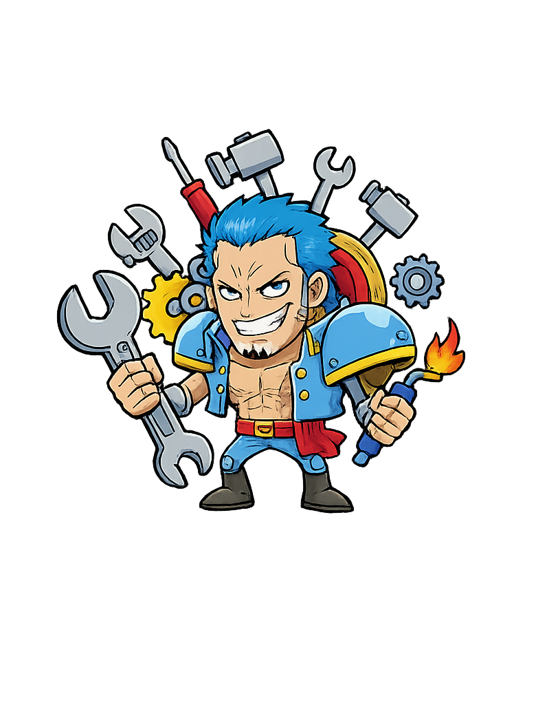
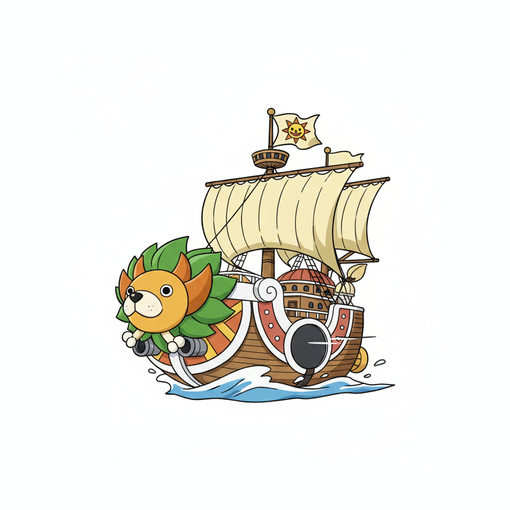
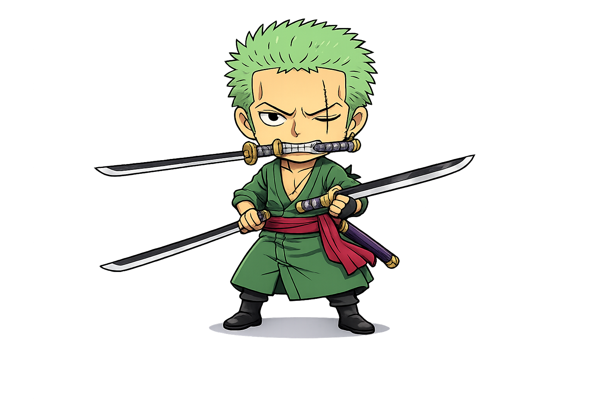
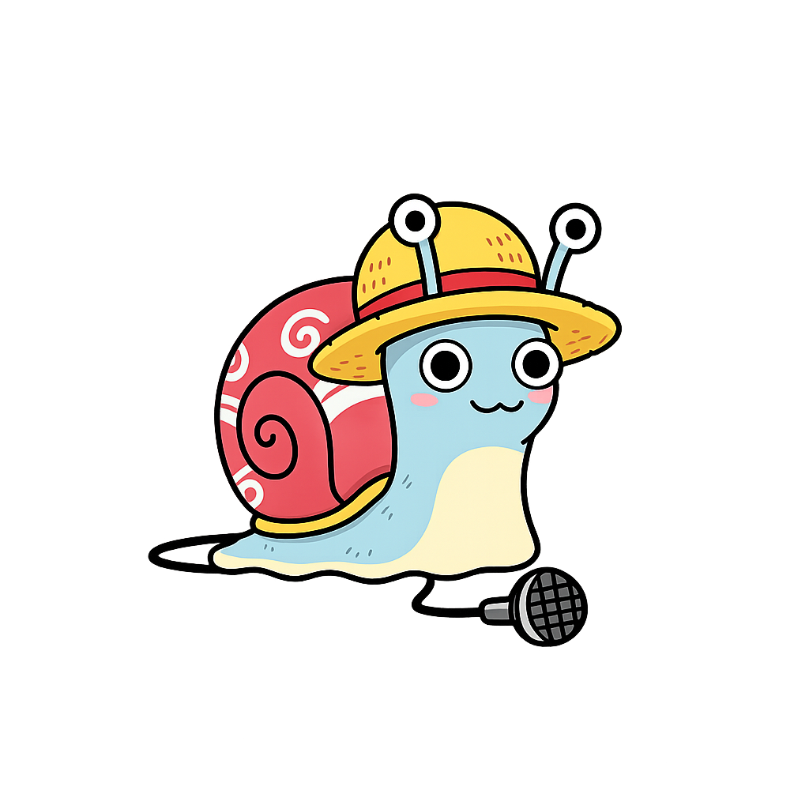

<h1 align="center">👋 Manu Martínez Saquero</h1>

  <strong>Software Developer · Backend & API Development</strong>  
  
  
  
  
  
  

  <i>Building backend solutions for real-world problems</i>
  

  📍 Spain (for now) · 🌍 Remote-first mindset · ❄️ Norra Sverige- Snart

---

<h2 align="center"> About me</h2>

I design and build <strong>clean, maintainable backend systems</strong>, APIs and internal tools. 
I work full-stack when needed, but my focus is always <strong>backend, data and architecture</strong>.

<h3 align="center">What drives me</h3>

🎯 <strong>Real usage</strong> – I build tools that people actually use 
🔨 <strong>Real problems</strong> – No demos, no toy projects 
📝 <strong>Production-ready code</strong> – If it's not documented, it doesn't exist 
🔄 <strong>Iterate fast</strong> – Ship, learn, improve

<strong>Code first, polish later.</strong> Functionality over perfection.

---

<h2 align="center"> Tech Stack</h2>

<table align="center">
<tr>
<td width="25%" valign="top">

<h3 align="center">Backend</h3>

<strong>Node.js</strong>, <strong>Express</strong> 
<strong>Prisma ORM</strong> 
<strong>PostgreSQL</strong> 
REST APIs 
JWT Authentication 
Swagger / OpenAPI

</td>
<td width="25%" valign="top">

<h3 align="center">Frontend</h3>

React 
TypeScript 
Vite 
Tailwind CSS

</td>
<td width="25%" valign="top">

<h3 align="center">Desktop & Automation</h3>

Electron 
Internal tools 
Process automation

</td>
<td width="25%" valign="top">

<h3 align="center">Background</h3>

Java (OOP fundamentals – DAM) 
SQL 
Git 
Systems & Networks (SMR)

</td>
</tr>
</table>

---

<h2 align="center"> Projects</h2>

<table align="center">
<tr>
<td width="50%" valign="top">

<h3 align="center">🟢 Dónde Comemos Hoy</h3>

Backend API and dashboard for a <strong>family-focused restaurant discovery platform</strong>.

  
  
  
  
  

A production-ready REST API that helps parents find family-friendly restaurants. Features advanced filtering (playground nearby, high chairs, kids menu), full JWT authentication, and comprehensive Swagger documentation. Built with scalability and reusability in mind—ready to be integrated into any frontend application.

👉 <a href="https://github.com/Saquero/dndcomhoy">View Project</a>

</td>
<td width="50%" valign="top">

<h3 align="center">🟢 Retail Cash Manager</h3>

Desktop application for <strong>daily cash closing in retail environments</strong>.

  
  
  

A cross-platform desktop app designed for retail workers to streamline end-of-day cash reconciliation. Calculates discrepancies, generates closing reports, and maintains historical records. Built from real-world retail experience—solving actual pain points, not hypothetical problems.

👉 <a href="https://github.com/Saquero/retail-cash-manager-cierres">View Project</a>

</td>
</tr>
</table>

---

<h2 align="center"> Core Strengths</h2>

⚔️ <strong>Problem solver</strong> – I translate business needs into solid technical architectures 
🎯 <strong>API design expert</strong> – RESTful endpoints that are intuitive, documented and scalable 
🧩 <strong>Clean code advocate</strong> – I write maintainable code that teams can work with long-term 
🚀 <strong>Delivery focused</strong> – I ship production-ready solutions, not prototypes 
📊 <strong>Data-driven</strong> – Strong database design and query optimization skills

---

<h2 align="center"> Current Journey</h2>

🔨 Building <strong>backend-first products</strong> that solve real market needs 
📐 Mastering <strong>system design patterns</strong> and scalable architectures 
📖 Creating <strong>professional-grade documentation</strong> for every project 
💼 Crafting a <strong>portfolio of production-ready code</strong> for top companies 
🎓 Deep-diving into <strong>PostgreSQL performance</strong> and <strong>distributed systems</strong> 
🌱 Exploring <strong>Docker, CI/CD pipelines</strong> and modern DevOps practices

---

<h2 align="center">📊 GitHub Stats</h2>

  

  
  

---

<h2 align="center"> Let's Build Together!</h2>

  
  
  

  <i>Open to backend development opportunities and technical collaborations</i>

